# MVP Backend Design — Refined (KISS, First Principles)

**Goal.** Ship a single, deployable backend that accepts arbitrary JSON and media via a single endpoint, makes a deterministic storage decision (SQL vs JSONB), and clusters media into human-meaningful directories. Design for a hackathon: minimal infra, CPU-only inference, clear extension points.

---

## 0. Constraints & Guiding Principles

1. KISS first: one deployable binary (monolith) with modular boundaries and clear interfaces.
2. One authoritative database: PostgreSQL (+ pgvector) holds metadata, vectors, and JSON payloads.
3. One object store abstraction: `fs://` for dev (local), `s3://` for production; swap with config.
4. No GPU requirement for MVP. Use small CPU-friendly models or heuristics; allow opt-in external APIs.
5. Idempotent, auditable ingest: every submitted object becomes an immutable raw record.
6. Async-by-default, sync-friendly: API acknowledges quickly; heavy work happens in workers.
7. Human-in-the-loop: cluster/schema decisions are provisional until confirmed in admin UI.

---

## 1. High-level Modules

* **HTTP API** — single entry point for all clients.
* **Ingest Orchestrator** — normalizes request, stores raw inputs, enqueues jobs.
* **Job Queue & Workers** — in-process queue for hackathon; Redis-backed later.
* **Media Processor** — thumbnailing, lightweight embedding, dedupe, cluster-assign.
* **JSON Processor** — flattening, schema inference, SchemaDecider (SQL vs JSONB), DDL generator.
* **Catalog / Metadata Store** — Postgres schema and helper queries.
* **Storage Adapter** — fs / s3 interchangeable implementation.
* **Admin UI (minimal)** — inspect pending schema changes, accept/rollback migrations, merge/split clusters.

---

## 2. API Surface (concise)

### POST /api/v1/ingest

* `multipart/form-data` or `application/json`.
* Fields:

  * `payload` — raw JSON object or JSON array (optional if files present).
  * `files[]` — binary parts (optional if JSON present).
  * `owner` (optional), `comments` (optional)
  * `idempotency-key` (recommended)
* Accept batch: if `payload` is an array, the API will create one ingest job per element and return a list.
* Response: `202 Accepted` with `ingest_job_id` and `system_ids[]` (one per logical object).

### GET /api/v1/ingest/{jobId}/status

* Returns job progress and per-object states: `queued`, `processing`, `done`, `failed`.

### GET /api/v1/objects/{system_id}

* Returns canonical metadata, storage URIs, cluster info, schema_id.

### GET /api/v1/search

* Query text → CLIP-text-encoder → ANN search in pgvector → filter by tags/owner/date.

### PATCH /api/v1/clusters/{clusterId}

* Admin operations: rename, merge, split (manual merge operations only for MVP).

---

## 3. Ingest Flow (deterministic)

1. **API receives request.**

   * Validate form and required fields.
   * Assign `request_id` and create raw placeholders in `asset_raw` table.
   * Persist raw bytes to `storage.incoming/{request_id}/{part_id}`.
   * Insert `lineage` record for traceability.
   * Return `202 Accepted` with `job_id`.

2. **Worker picks job.**

   * Load raw bytes and metadata.
   * Classify each part: `media` (image/video/audio) or `json`.
   * Always write a canonical `asset` row with `status = processing`.

3. **Process media** or **process JSON** (parallel per-part). Worker reports progress to lineage.

4. **Finalize.**

   * Update `asset` with embedding, tags, cluster_id OR schema_id and DDL reference.
   * Move files from `incoming/` to `canonical/` under cluster directory.
   * Emit event for UI/consumer.

All steps keep raw input intact.

---

## 4. SchemaDecider — algorithm (deterministic, conservative)

**Purpose.** Decide `sql` vs `jsonb` storage for incoming JSON collections automatically and generate safe DDL candidates.

**Inputs.** Up to `N_sample = min(128, batch_size)` documents (random sample for large batches).

**Steps.**

1. Flatten paths up to `depth = 3`. Record data types per path and presence fraction.
2. Compute `stability(path) = fraction_of_samples_where_path_present` and `type_stability(path) = fraction_of_samples_with_same_type`.
3. Heuristics:

   * Prefer `sql` if **all** the following hold:

     * `num_top_level_keys <= 20`
     * `avg_field_stability >= 0.6` for top-level fields
     * `max_depth <= 2`
     * No fields that are arrays of objects
   * Otherwise prefer `jsonb`.
4. If foreign-key-like fields exist (names ending with `_id` and high cardinality), recommend child table creation.
5. Always produce a `fallback: extra JSONB` column in SQL decisions.
6. Generate DDL candidate with explicit column types (text, numeric, boolean, timestamptz) and suggested indexes (top-K selective scalar fields).
7. Persist `schema_proposal` and mark `schema.status = provisional` until admin acceptance. Auto-apply only if `auto_migrate=true` config.

**Config knobs** (editable): `N_sample`, `stability_threshold`, `max_top_level_keys`, `max_depth`.

---

## 5. Data Model (concise; authoritative in Postgres)

* `asset_raw` (immutable): raw bytes pointer, request_id, part_id, created_at
* `asset`:

  * `id UUID PK`, `kind ENUM(media|json)`, `uri text`, `sha256 text`, `content_type text`, `size_bytes bigint`, `created_at`, `owner text`, `status text`, `cluster_id uuid`, `schema_id uuid`, `tags text[]`, `embedding vector(<dim>)`
* `cluster`:

  * `id UUID PK`, `name text`, `centroid vector(<dim>)`, `threshold real`, `created_at`, `updated_at`, `provisional boolean`
* `schema_def`:

  * `id UUID PK`, `name text`, `structure_hash text unique`, `storage_choice enum(sql|jsonb)`, `version int`, `ddl text`, `status enum(provisional|active|rejected)`
* `lineage` (audit): `id, request_id, asset_id, schema_id, stage, detail jsonb, created_at`

**Extensions for video frames** (optional): `video_frame(id, asset_id, frame_idx, embedding vector)`

**Indexes**: GIN on `tags`, pgvector ANN on `embedding`, GIN on `docs_<collection>.doc`.

---

## 6. Media Processing (CPU-friendly defaults)

**Images.**

* Normalize to max side `1024`.
* Compute `pHash` for cheap dedupe.
* Compute embedding using a small model: `all-MiniLM` for textual, `OpenCLIP ViT-B/32` ONNX for images (CPU). If embedding unavailable, fallback to `color histogram + pHash` distance.
* Extract EXIF and basic visual features.

**Videos.**

* Extract up to `N_keyframes = min(3, duration_seconds/10)` using ffmpeg scene detection.
* Embed frames and mean-pool into an asset-level vector.
* Keep frame vectors in `video_frame` table for reranking if needed.

**Clustering.**

* Use pgvector ANN search (HNSW if available). Find nearest cluster centroid.
* Assign to cluster if `cosine_sim >= cluster.threshold` else create new cluster.
* New cluster centroid = initial vector; update centroid by incremental mean on attach or schedule periodic recompute.

**Deduplication.**

* If `sha256` or `pHash` matches existing asset in same cluster, mark as duplicate and link rather than move file (keep both or dedupe per config).

---

## 7. Vector & Embedding Choices (practical)

* **Dimensionality**: choose `dim = 512` for OpenCLIP ViT-B/32 or `dim = 384` for smaller models.
* **Provider (cheap)**: local ONNX CLIP conversion, or use `sentence-transformers/all-MiniLM-L6-v2` for text -> image proxy embedding.
* **Vector Store**: pgvector inside Postgres. Advantages: single backup, simple ops, no extra service.
* **ANN Index**: HNSW preferred; fallback to IVFFlat in constrained builds.

Trade-offs: CPU-based embeddings slower per item but simpler to run in a hackathon environment.

---

## 8. Failure Modes & Mitigations (practical)

1. **Unexpected JSON shape → crash**: always store original JSON; run SchemaDecider in a sandbox; workers must never mutate original payload.
2. **Auto-DDL misstep**: make migrations provisional; admin needs to accept before SQL path becomes active. Always keep JSONB backup.
3. **Embedding slowdown**: limit parallel workers; pre-warm model; provide feature-flag fallback to `pHash`/histogram.
4. **Cluster drift / noisy centroids**: mark clusters as `provisional` until `N_confirm >= 3` assets, allow manual merge/split.
5. **Duplicate records**: use content hashes + idempotency-key; surface duplicates in admin UI.
6. **Storage outage**: ingest still accepts and records `asset_raw` pointer; if storage fails, mark job `failed` with explicit retry policy.

---

## 9. Observability & SLOs (demo targets)

* **API**: ack latency < 200ms for JSON-only small payloads.
* **Processing**: median processing time per small image < 1.5s on 4 vCPU. (If embedding used, expect 1–3s.)
* **SLOs for demo**: 95% ingests processed within 60s.

**Metrics to export**:

* `ingest.requests`, `ingest.latency`, `job.queue_depth`, `job.processing_time`, `embeddings.time`, `clusters.created`, `schema_proposals`.

**Logs**: structured JSON with `request_id`, `asset_id`, `job_stage`, `error`.

---

## 10. Minimal DDL (example)

```sql
CREATE EXTENSION IF NOT EXISTS vector;

CREATE TABLE asset_raw (
  id uuid PRIMARY KEY,
  request_id text,
  part_id text,
  uri text,
  size_bytes bigint,
  created_at timestamptz DEFAULT now()
);

CREATE TABLE asset (
  id uuid PRIMARY KEY,
  kind text CHECK (kind IN ('media','json')) NOT NULL,
  uri text NOT NULL,
  sha256 text,
  content_type text,
  size_bytes bigint,
  owner text,
  created_at timestamptz DEFAULT now(),
  status text,
  cluster_id uuid,
  schema_id uuid,
  tags text[],
  embedding vector(512)
);

CREATE TABLE cluster (
  id uuid PRIMARY KEY,
  name text,
  centroid vector(512),
  threshold real DEFAULT 0.8,
  provisional boolean DEFAULT true,
  created_at timestamptz DEFAULT now(),
  updated_at timestamptz DEFAULT now()
);

CREATE TABLE schema_def (
  id uuid PRIMARY KEY,
  name text,
  structure_hash text UNIQUE,
  storage_choice text CHECK (storage_choice IN ('sql','jsonb')),
  version int DEFAULT 1,
  ddl text,
  status text DEFAULT 'provisional'
);

CREATE TABLE lineage (
  id uuid PRIMARY KEY,
  request_id text,
  asset_id uuid,
  schema_id uuid,
  stage text,
  detail jsonb,
  created_at timestamptz DEFAULT now()
);

-- Example: per-collection docs table created at runtime:
-- CREATE TABLE docs_<collection> (id uuid PRIMARY KEY, doc jsonb, created_at timestamptz DEFAULT now());
```

---

## 11. Deployment Recipe (hackathon)

1. Use `docker-compose` with services: Postgres (pgvector), app (single image), Redis (optional), MinIO (optional).
2. Entrypoint spawns HTTP server and N worker threads (configurable). Worker preloads embedding model.
3. Mount host volumes for `media/` and `derived/`.
4. Run DB migrations at startup; keep migrations idempotent.

**Scaling**: scale by running multiple app replicas behind a load balancer and using Redis queue; migrate vector index to Milvus if needed.

---

## 12. Demo Checklist (one-liners)

* [ ] Start `docker-compose` and confirm `/live` and `/ready`.
* [ ] POST 100 mixed objects via provided script (batch ingestion).
* [ ] Confirm at least one `sql` schema proposal and one `jsonb` storage used.
* [ ] Show cluster directory with duplicates grouped.
* [ ] Admin UI: accept a schema proposal and observe assets materialize into SQL table.
* [ ] Run text→image search and show results.

---

## 13. Where to cut scope (recommended for hackathon)

1. Do not implement automatic video transcoding; only extract up to 3 keyframes.
2. Keep cluster merges/splits manual in admin UI.
3. Make SQL migrations provisional; require admin acceptance for production-grade behavior.
4. Use local ONNX or CPU-only models. Only add remote paid APIs if absolutely necessary.

---

## 14. Next deliverables I can produce (pick any)

* Full OpenAPI spec and example curl scripts for ingestion and search.
* Worker pseudocode + job JSON schemas.
* SQL migration generator pseudocode (safe, reversible diffs).
* `docker-compose.yml` and a minimal `seed_data.sh` script for demo.
* Minimal React admin UI wireframe and JSON responses expected by UI.

---

## 15. End-to-end Flow (Mermaid)

```mermaid
flowchart TB
  subgraph Clients["📱 Client Layer"]
    U["Client Applications<br/>(CLI tools, SDKs, Web UI)<br/><i>Users upload media files or JSON documents</i>"]
  end

  subgraph Ingress["🚪 Ingress Layer - Request Entry Point"]
    A["HTTP API Gateway<br/><i>POST /api/v1/ingest endpoint<br/>Accepts multipart/form-data or JSON<br/>Returns 202 Accepted with job_id</i>"]
    V["Request Validator<br/><i>Validates payload size, MIME types<br/>Checks idempotency keys<br/>Extracts metadata (owner, comments)</i>"]
  end

  subgraph Storage["💾 Object Storage Layer (Local Filesystem)"]
    Sraw[("Raw Incoming Storage<br/>incoming/request_id/part_id<br/><i>Temporary holding area for<br/>unprocessed uploads</i>")]
    Scanon[("Canonical Media Storage<br/>media/clusters/cluster_id/asset_id<br/><i>Final organized location<br/>grouped by similarity clusters</i>")]
    Sder[("Derived Assets Storage<br/>media/derived/cluster_id/asset_id/<br/><i>Thumbnails, transcoded videos,<br/>processed derivatives</i>")]
  end

  subgraph Metadata["🗄️ PostgreSQL Database + pgvector Extension"]
    Arw[("asset_raw Table<br/><i>Immutable record of every<br/>raw upload with URI pointer</i>")]
    Ast[("asset Table<br/><i>Canonical metadata: embeddings,<br/>tags, cluster_id, schema_id,<br/>status, content_type</i>")]
    Clu[("cluster Table<br/><i>Media clusters: centroid vectors,<br/>thresholds, provisional flags,<br/>human-readable names</i>")]
    Sch[("schema_def Table<br/><i>JSON schema proposals:<br/>structure_hash, storage_choice<br/>(SQL vs JSONB), DDL, status</i>")]
    Lin[("lineage Table<br/><i>Audit trail: request_id, asset_id,<br/>processing stages, timestamps,<br/>error details</i>")]
    Vid[("video_frame Table<br/><i>Per-frame embeddings for videos<br/>enabling frame-level search</i>")]
  end

  subgraph Queueing["⚙️ Job Orchestration - Async Processing"]
    JQ[["Job Queue<br/>(In-process or Redis)<br/><i>Holds pending processing jobs<br/>with asset_id, content_type, metadata</i>"]]
    DLQ[["Dead-Letter Queue<br/><i>Failed jobs after retries<br/>require operator intervention</i>"]]
  end

  subgraph Workers["👷 Worker Runtime - Background Processing"]
    W["Worker Supervisor<br/><i>Polls queue, spawns workers,<br/>manages concurrency limits</i>"]
    subgraph MediaFlow["🎬 Media Processing Pipeline"]
      MP["Media Processor<br/><i>Orchestrates: normalization,<br/>thumbnail generation,<br/>EXIF extraction</i>"]
      EMB["CLIP Embedding Engine<br/>(CPU/ONNX Runtime)<br/><i>Converts images/video frames<br/>to 512-d vectors for similarity</i>"]
      TAG["Zero-shot Tagger<br/><i>Uses CLIP text encoder to<br/>generate descriptive tags<br/>(e.g., 'dog', 'sunset')</i>"]
      CLUASSIGN["Cluster Assignment Strategy<br/><i>ANN search in pgvector to find<br/>nearest cluster centroid<br/>Creates new cluster if threshold exceeded</i>"]
    end
    subgraph JsonFlow["📄 JSON Processing Pipeline"]
      JP["JSON Normalizer<br/><i>Flattens nested structures,<br/>detects data types, computes<br/>field presence statistics</i>"]
      SD["SchemaDecider Algorithm<br/><i>Analyzes structure stability,<br/>chooses SQL vs JSONB storage,<br/>generates provisional DDL</i>"]
      SQLP["SQL Materializer<br/><i>Creates normalized tables,<br/>applies migrations, maps<br/>JSON fields to columns</i>"]
      JSONBP["JSONB Upserter<br/><i>Stores documents in<br/>docs_collection tables<br/>with GIN indexes</i>"]
    end
  end

  subgraph Admin["👨‍💼 Admin & Human Feedback Loop"]
    UI["Admin UI Dashboard<br/><i>Review schema proposals,<br/>accept/reject migrations,<br/>inspect cluster assignments</i>"]
    FB["Manual Override Service<br/><i>Allows admins to merge clusters,<br/>rename directories, adjust<br/>schema decisions</i>"]
  end

  subgraph Observability["📊 Observability & Monitoring"]
    LOG["Structured JSON Logs<br/><i>Request_id correlation,<br/>stage-level events, errors</i>"]
    MET["Metrics Export<br/>(Prometheus format)<br/><i>Ingest latency, queue depth,<br/>processing time, cluster counts</i>"]
    TRC["Distributed Tracing<br/><i>End-to-end request flow<br/>across all components</i>"]
    ALR["Alerting Rules<br/><i>DLQ growth, latency spikes,<br/>processing failures</i>"]
  end

  %% Client to Ingress
  U -->|"1. Upload Request<br/>(multipart/json payload<br/>+ optional metadata)"| A
  A -->|"2. Validate & Extract<br/>(size limits, MIME check,<br/>idempotency validation)"| V

  %% Ingress to Storage & Database
  V -->|"3a. Persist Raw Bytes<br/>(always keep original<br/>for audit/replay)"| Sraw
  V -->|"3b. Create Raw Record<br/>(insert into asset_raw<br/>with URI pointer)"| Arw
  V -->|"3c. Enqueue Processing Job<br/>(async, non-blocking<br/>returns job_id immediately)"| JQ
  V -->|"3d. Log Ingest Event<br/>(audit trail start)"| Lin
  V -->|"4. Return 202 Accepted<br/>(job_id, system_ids)"| U

  %% Queue to Workers
  JQ -->|"5. Dequeue Job<br/>(worker picks next<br/>pending item)"| W
  W -->|"6a. Route Media Files<br/>(images, videos, audio)"| MP
  W -->|"6b. Route JSON Documents<br/>(structured data objects)"| JP
  W -->|"7. Failed Jobs<br/>(after max retries)"| DLQ
  DLQ -->|"8. Manual Replay<br/>(operator fixes issue<br/>and retries)"| W

  %% Media Processing Flow
  MP -->|"9a. Extract & Normalize<br/>(resize images, extract<br/>keyframes from video)"| EMB
  EMB -->|"9b. Store Embedding Vector<br/>(512-d CLIP vector<br/>in asset.embedding)"| Ast
  EMB -->|"9c. Find Nearest Cluster<br/>(ANN search via pgvector<br/>cosine similarity)"| CLUASSIGN
  CLUASSIGN -->|"9d. Update Cluster Metadata<br/>(assign asset_id or<br/>create new cluster)"| Clu
  CLUASSIGN -->|"9e. Move File to Final Location<br/>(from incoming/ to<br/>clusters/cluster_id/)"| Scanon
  MP -->|"9f. Generate Tags<br/>(zero-shot classification<br/>using CLIP text encoder)"| TAG
  TAG -->|"9g. Store Tags Array<br/>(descriptive labels<br/>in asset.tags)"| Ast
  MP -->|"9h. Generate Thumbnails<br/>(small preview images)"| Sder
  MP -->|"9i. Log Processing Complete<br/>(update lineage with<br/>final status)"| Lin

  %% JSON Processing Flow
  JP -->|"10a. Analyze Structure<br/>(flatten paths, compute<br/>field stability metrics)"| SD
  SD -->|"10b. Create Schema Proposal<br/>(structure_hash, storage_choice,<br/>DDL candidate, status=provisional)"| Sch
  SD -->|"10c. Notify Admin<br/>(new proposal requires<br/>human review)"| UI
  UI -->|"10d. Accept/Reject Decision<br/>(admin approves migration<br/>or rejects proposal)"| Sch
  Sch -->|"10e. Update Schema Status<br/>(provisional → active<br/>or rejected)"| Lin
  SD -->|"10f. If SQL Chosen<br/>(structured, stable schema)"| SQLP
  SQLP -->|"10g. Execute DDL Migration<br/>(create tables, indexes,<br/>only if status=active)"| Sch
  SQLP -->|"10h. Insert into SQL Tables<br/>(normalized columns,<br/>foreign keys)"| Ast
  SD -->|"10i. If JSONB Chosen<br/>(flexible, nested documents)"| JSONBP
  JSONBP -->|"10j. Upsert into Collection<br/>(docs_collection table<br/>with JSONB column)"| Ast

  %% Search & Query Flow
  A -->|"11a. Semantic Search Query<br/>(text: 'dog' or 'monkey with hat')"| Ast
  Ast -->|"11b. ANN Search Results<br/>(CLIP text encoder → vector,<br/>cosine similarity in pgvector)"| A
  A -->|"11c. Job Status Poll<br/>(GET /ingest/job_id/status)"| Lin
  Lin -->|"11d. Return Progress<br/>(queued/processing/done/failed)"| A
  A -->|"11e. Catalog Lookup<br/>(GET /objects/system_id)"| Ast
  Ast -->|"11f. Return Metadata<br/>(cluster info, schema_id,<br/>storage URIs, tags)"| A

  %% Admin Feedback Loop
  FB -->|"12a. Override Cluster Assignment<br/>(merge clusters, rename,<br/>adjust thresholds)"| CLUASSIGN
  FB -->|"12b. Override Schema Decision<br/>(force SQL/JSONB choice,<br/>modify DDL)"| SD

  %% Observability
  W -->|"13a. Emit Logs<br/>(structured JSON with<br/>request_id correlation)"| LOG
  W -->|"13b. Export Metrics<br/>(counters, histograms,<br/>gauges)"| MET
  W -->|"13c. Record Traces<br/>(span per component,<br/>timing data)"| TRC
  DLQ -->|"13d. Alert on Failures<br/>(DLQ depth exceeds<br/>threshold)"| ALR
  MET -->|"13e. Alert on Anomalies<br/>(latency spikes,<br/>error rate increases)"| ALR

  %% Styling
  classDef storageClass fill:#e1f5ff,stroke:#01579b,stroke-width:2px
  classDef dbClass fill:#f3e5f5,stroke:#4a148c,stroke-width:2px
  classDef processClass fill:#e8f5e9,stroke:#1b5e20,stroke-width:2px
  classDef adminClass fill:#fff3e0,stroke:#e65100,stroke-width:2px
  classDef obsClass fill:#fce4ec,stroke:#880e4f,stroke-width:2px

  class Sraw,Scanon,Sder storageClass
  class Arw,Ast,Clu,Sch,Lin,Vid dbClass
  class MP,EMB,TAG,CLUASSIGN,JP,SD,SQLP,JSONBP,W processClass
  class UI,FB adminClass
  class LOG,MET,TRC,ALR obsClass
```



---

*End of design. Keep this document authoritative for the hackathon MVP; implementation must obey the conservative defaults (provisional migrations, raw-preservation, admin approval).*
